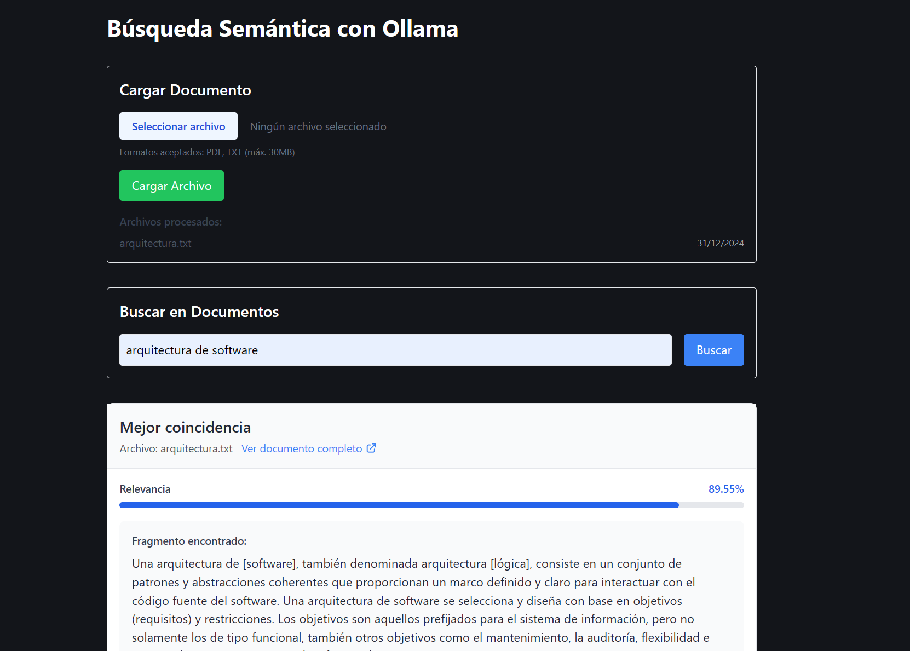

# SemanticLlama 🦙

> Motor de búsqueda semántica inteligente potenciado por Ollama y Astro.
> 

[](https://app.netlify.com/sites/semantic-llama/deploys)

## 📋 Descripción

SemanticLlama es un motor de búsqueda semántica que utiliza la potencia de Ollama y el modelo Llama2 para entender el significado profundo de los textos. Construido con Astro para ofrecer un rendimiento excepcional, este proyecto permite encontrar contenido similar basándose en el significado real de las palabras, no solo en coincidencias exactas.

## ✨ Características principales

- 🔍 **Búsqueda Semántica Avanzada**: Encuentra contenido similar basado en el significado
- ⚡ **Procesamiento en Tiempo Real**: Generación de embeddings y cálculo de similitud instantáneos
- 🎨 **Interfaz Intuitiva**: Diseño limpio y responsive
- 🚀 **Alto Rendimiento**: Construido con Astro
- 🤖 **Integración con Ollama**: Modelos de lenguaje de última generación

## 🚀 Inicio rápido

1. **Requisitos previos**

```bash
# Asegúrate de tener Ollama instalado y ejecutando
ollama pull llama3.2
```

2. **Instalación**

```bash
# Clona el repositorio
git clone https://github.com/devlitus/semantic-llama
cd semantic-llama

# Instala las dependencias
npm install
```

3. **Configuración**

```bash
# Copia el archivo de ejemplo de variables de entorno
cp .env.example .env

# Configura las variables necesarias en el archivo .env
```

4. **Ejecución**

```bash
# Inicia el servidor de desarrollo
npm run dev
```

## 🛠️ Tecnologías

- [Astro](https://astro.build) - Framework web
- [Ollama](https://ollama.ai) - Modelo de IA
- TypeScript - Lenguaje de programación
- TailwindCSS - Framework CSS

## 📚 Casos de uso

- ✅ Sistemas de recomendación de contenido
- ✅ Búsqueda en documentación técnica
- ✅ Clasificación automática de textos
- ✅ Análisis de similitud en bases de conocimiento
- ✅ Sistemas de FAQ inteligentes

## 🤝 Contribuir

Las contribuciones son bienvenidas. Por favor, lee nuestra guía de contribución antes de enviar un PR.

1. Fork el proyecto
2. Crea tu rama de características (`git checkout -b feature/AmazingFeature`)
3. Commit tus cambios (`git commit -m 'Add: alguna característica asombrosa'`)
4. Push a la rama (`git push origin feature/AmazingFeature`)
5. Abre un Pull Request

## 📄 Licencia

Este proyecto está bajo la Licencia MIT - ver el archivo [LICENSE.md](LICENSE.md) para más detalles.

## 🙋‍♂️ Soporte

Si tienes alguna pregunta o sugerencia, no dudes en:

- Abrir un issue
- Contactarnos a través de [correo](mailto:devlitus@gmail.com)

---

Hecho con ❤️ por [devlitus](https://github.com/devlitus)
